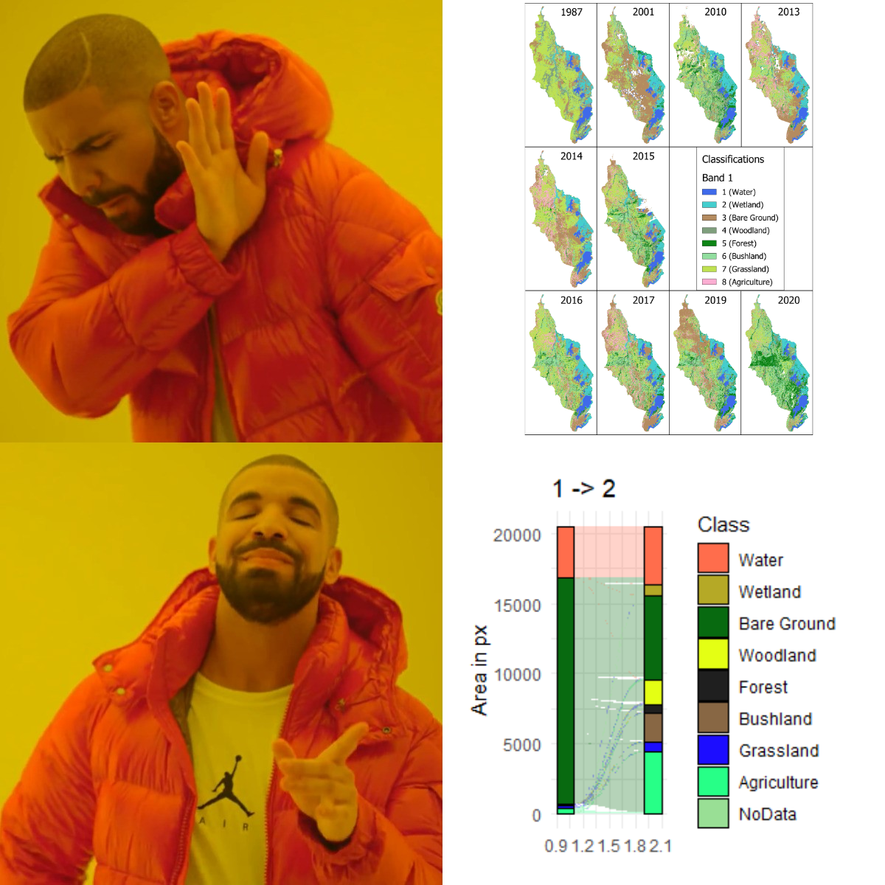
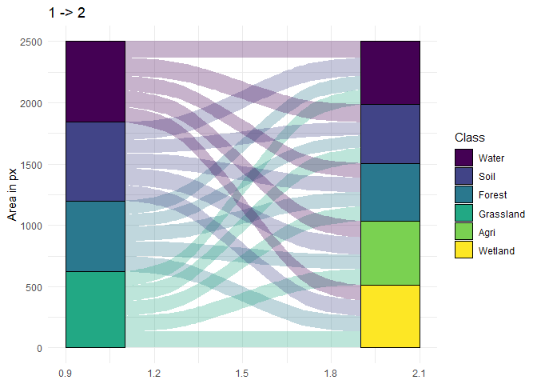

## Why `alluvial_pairs_diagram()`?

- Have you ever wanted to visualize land cover change in a aesthetically
  pleasing way?
- Have you struggled with coloring ggplot geometries?
- Then this package is for you

<figure>

<figcaption aria-hidden="true">Relevant meme #1</figcaption>
</figure>

The `alluvial_pairs_diagram()` function is intended for a visually
pleasing representation of a from-to relationship of 2 land cover
classification maps. Crosstables/contingency tables/change matrices can
be difficult to interpret and are not intuitive to read. This pairwise
alluvial diagram shows how much of a class existed at time t1 and at
time t2. It also shows how much of each class changed/transitioned to
another. In many cases regarding land cover this can be as relevant as
the absolute change, and is often vital to understanding change
processes better.

## How to use:

The 3 components required to build alluvial pairs are:

1.  A `terra` `SpatRaster` with at least 2 layers
2.  A lookup table with 3 columns, one row per occurring class
3.  A user-defined value to assign NA/NaN values to.

### Preparing the raster:

You can either use the example rasters provided in this package using
`system.file()`, or create your own arbitrary raster like this: (Import
`terra` because the `alluvial_pairs_diagram()` imports are specific and
it doesn’t use `terra::rast()`)

``` r
library(terra)
#> Warning: Paket 'terra' wurde unter R Version 4.3.3 erstellt
#> terra 1.8.29
t1 <- rast(nrows=50, ncols=50)
values(t1) <- sample(1:4, ncell(t1), replace=TRUE)
t2 <- rast(nrows=50, ncols=50)
values(t2) <- sample(2:6, ncell(t2), replace=TRUE)

rstack <- c(t1, t2) # combine into a multi-layer SpatRaster object

plot(t1, main="t1")
plot(t2, main="t2")
```


Note that different amounts of classes can occur in each layer, this is
handled by the function.

## Preparing the lookup table

The lookup table is the functions reference to match the correct class
ID/raster value with it’s corresponding name and colour. Since this
function is aimed at land cover change analysis you probably know which
classes (values) occur in your raster and what they are called. If you
are unsure you can check this by calling
`unique(terra::values(your_raster)` like below. Since we have created
virtual rasters in the previous step we can now make an imaginative
lookup table.

``` r
vals <- unique(as.vector(values(rstack)))
print(vals)
#> [1] 3 1 4 2 6 5

lut <- data.frame(id = vals,
                  class = c("Water", "Soil", "Forest", "Grassland", "Agri", "Wetland"),
                  mycolours = viridis::viridis(6))
print(lut)
#>   id     class mycolours
#> 1  3     Water #440154FF
#> 2  1      Soil #414487FF
#> 3  4    Forest #2A788EFF
#> 4  2 Grassland #22A884FF
#> 5  6      Agri #7AD151FF
#> 6  5   Wetland #FDE725FF
```

Your lookup table should always follow the above structure. Class ID in
the first, class name in the second and colour in the third column.

### Important Note!

As we are working with a fictional raster in this example we can use the
`vals` vector as is. *If you are working with your own data the order of
the ID column matters!* Please double check your lookup table and makes
sure that the correct class ID is associated with the correct name and
colour. **This is thematic information and does not throw an error if
done wrong. This mistake can be extremely difficult to spot from the
diagram alone!**

## NA value handling

If you have `NA` or `NaN` values in your raster, because of
non-rectangular geometry, cloud cover or other reasons, you can assign
these to a new class using the `naValue` argument of the function. If
they already have a ID value assigned you should include this in the
lookup table.

**The new NA value must be included in the lookup table** like below:

``` r
new_lut <- data.frame(id = 1:7, # 7 will become NA value!
                  class = c("Water", "Soil", "Forest", "Grassland", "Agri", "Wetland", "NoData"),
                  mycolours = viridis::viridis(7)) # need 7 colours now

diagrams <- alluvial_pairs_diagram(raster = rstack, lookup = new_lut, naValue = 7)
```

## Creating the diagram(s)

Once the lookup table is set up correctly we can use the function. If
the rasters you are working with have times assigned to them you can use
`terra::time()` to set a time for each layer, this will include the
information in the plot. If the layers to not have times associated with
them the function will use the layer number instead, like below.

Finally, the `a_unit` parameter can be used to change the y axis label
to the area measurement unit (pixels in the case of our virtual rasters)

``` r
diagrams <- alluvial_pairs_diagram(raster = rstack, lookup = lut)
#> Raster levels set using LUT.
plot(diagrams[[1]])
```

<!-- -->

## Using the package example data:

3 sample land cover classification rasters (Landsat-5) from Akagera
National Park, Rwanda, as well as a corresponding lookup table are
included in the package so you can try out the workflow without much
setup:

``` r
library(terra) # As lcutils functions themselves do not use terra::rast() we have to import it here

# get the file paths:
p1 <- system.file("extdata", "akagera1987.tif", package = "lcutils")
p2 <- system.file("extdata", "akagera2001.tif", package = "lcutils")
p3 <- system.file("extdata", "akagera2002.tif", package = "lcutils")
plut <- system.file("extdata", "akagera_LUT.csv", package = "lcutils")

# load the data:
rstack <- terra::rast(c(p1,p2,p3))
lut <- read.csv(plut)
lut <- lut[,2:4] # remove index column

# plot the raster for 1987:
plot(rstack[[1]], col = lut[,3])
```

<!-- -->

``` r
# create alluvial pair diagrams:
plots <- alluvial_pairs_diagram(raster = rstack,
                                         lookup = lut,
                                         naValue = 9,
                                         a_unit = "px")
#> Raster levels set using LUT.
#> Raster levels set using LUT.

plot(plots[[1]])
```


``` r
plot(plots[[2]])
```


## A note on `rename_shapefile()`

This very self-explanatory function was created out of pure annoyance.
Please use GeoPackage (.gpkg) files instead of shapefiles!
